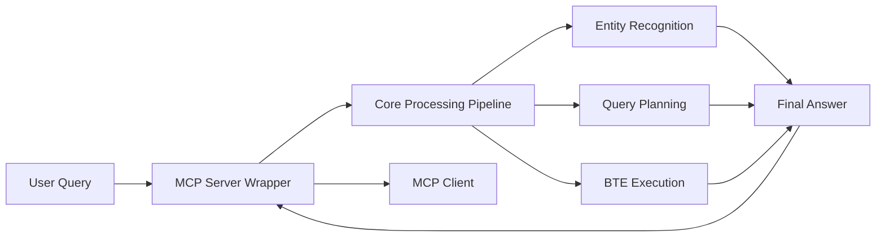
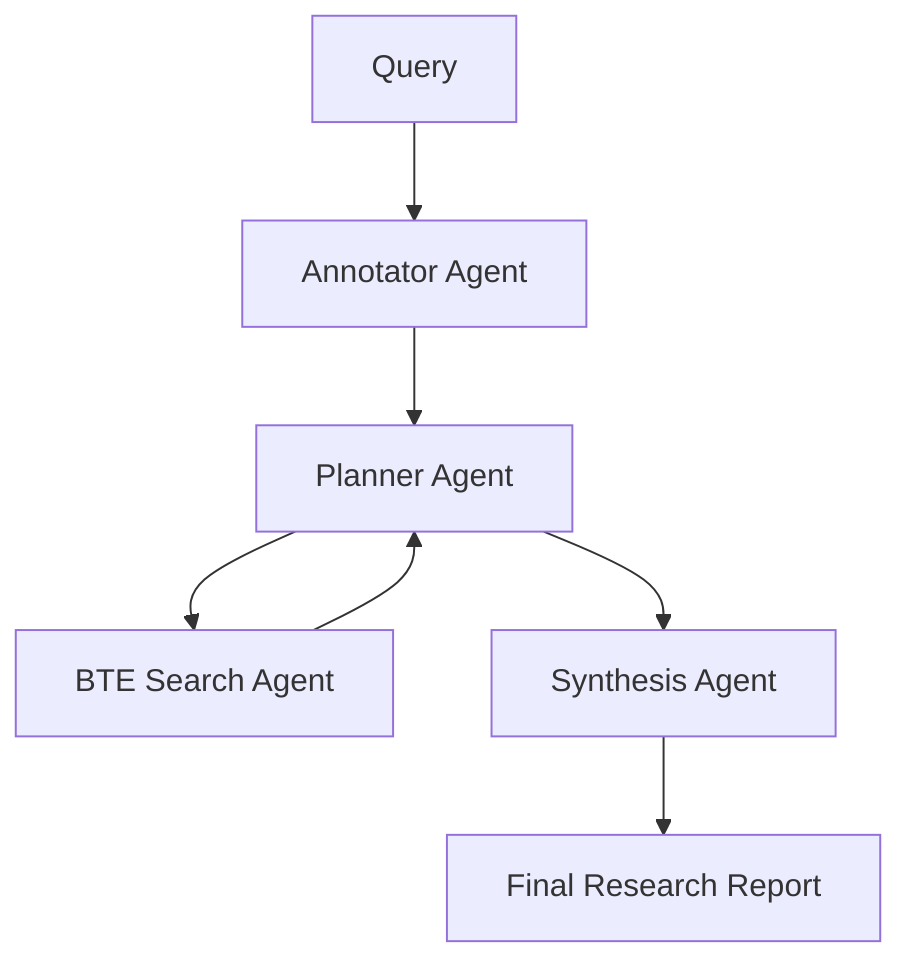

# Agentic BTE 🧬🤖

> **AI-Powered Biomedical Knowledge Graph Queries**  
> Intelligent agents for drug discovery, disease research, and biomedical question answering using BioThings Explorer

[](https://www.python.org/downloads/)
[](https://opensource.org/licenses/MIT)
[](https://github.com/psf/black)

## 🎯 Overview

**Agentic BTE** is a next-generation biomedical research platform that combines the power of:

- **🧠 Large Language Models** (GPT-4, Claude) for intelligent query understanding
- **🕸️ Knowledge Graphs** via BioThings Explorer for comprehensive biomedical data
- **🤖 AI Agents** using LangGraph and MCP protocols for autonomous research workflows
- **⚡ Query Optimization** with advanced decomposition and planning strategies

### ✨ Key Features

- 🔬 **Biomedical NER**: Extract and link biomedical entities using spaCy/SciSpaCy + LLMs
- 🧬 **Smart Query Classification**: Automatically categorize research questions for optimal processing
- ⚙️ **Query Optimization**: Decompose complex questions into optimized subquery strategies
- 🌐 **Multi-Agent Architecture**: LangGraph orchestration with specialized research agents
- 🔌 **MCP Server**: Model Context Protocol integration for seamless AI tool usage
- 📊 **Entity Resolution**: Map biomedical IDs to human-readable names
- 🎯 **Drug Discovery Focus**: Specialized workflows for therapeutic research

## 🚀 Quick Start

### Installation

```bash
# Install from PyPI (when available)
pip install agentic-bte

# Or install from source
git clone https://github.com/example/agentic-bte.git
cd agentic-bte
pip install -e .
```

### Setup Environment

```bash
# Copy environment template
cp .env.example .env

# Edit with your API keys
export AGENTIC_BTE_OPENAI_API_KEY="your-openai-key"
export AGENTIC_BTE_DEBUG_MODE=true
```

### Install SpaCy Models (Optional but Recommended)

```bash
# Install biomedical NLP models
python -m spacy download en_core_sci_lg
pip install https://s3-us-west-2.amazonaws.com/ai2-s2-scispacy/releases/v0.5.1/en_ner_bc5cdr_md-0.5.1.tar.gz
```

## 📖 Usage Examples

### 🔬 Basic Entity Recognition

```python
from agentic_bte.core.entities import extract_entities

# Extract biomedical entities from text
entities = extract_entities("What drugs can treat Alzheimer's disease?")
print(entities)
# Output: ['drugs', 'treat', "Alzheimer's disease"]
```

### 🤖 MCP Server Usage

Start the MCP server:

```bash
agentic-bte-mcp
```

Then use with any MCP-compatible client:

```python
# Example MCP client usage
from mcp import Client

client = Client("agentic-bte-mcp")

# Ask complex biomedical questions
result = await client.call_tool(
    "plan_and_execute_query",
    {
        "query": "Which drugs can treat Angina Pectoris by acting on vasodilation?",
        "execute_after_plan": True,
        "max_results": 10
    }
)

print(result["final_answer"])
# Gets: AI-generated list of vasodilatory drugs for angina
```

### 🧠 LangGraph Multi-Agent Workflow

```python
from agentic_bte.agents import BiomedicalResearchAgent

# Initialize the multi-agent system
agent = BiomedicalResearchAgent()

# Run complex research workflow
result = agent.research(
    query="How does metformin treat diabetes?",
    include_mechanism=True,
    max_depth=3
)

print(result.summary)
# Gets: Comprehensive mechanism of action analysis
```

### ⚡ Direct API Usage

```python
from agentic_bte.core.queries import QueryClassifier, QueryDecomposer
from agentic_bte.core.knowledge import BTEClient

# Classify query type
classifier = QueryClassifier()
query_type = classifier.classify("What genes cause breast cancer?")
print(query_type)  # QueryType.DISEASE_GENE

# Decompose into subqueries  
decomposer = QueryDecomposer()
plan = decomposer.decompose(
    query="What drugs treat diabetes?",
    query_type=QueryType.DISEASE_TREATMENT
)

# Execute against BTE knowledge graph
bte_client = BTEClient()
results = bte_client.execute_plan(plan)
```

## 🏗️ Architecture

### 🧱 Core Components

```
agentic_bte/
├── core/                      # Core biomedical processing
│   ├── entities/              # Entity recognition & linking  
│   ├── queries/               # Query classification & optimization
│   └── knowledge/             # Knowledge graph interactions
├── agents/                    # AI agent implementations
├── servers/                   # Server implementations (MCP, API)
└── utils/                     # Shared utilities
```

### 🔄 Processing Pipeline

1. **🔤 Entity Recognition**: Extract biomedical entities using spaCy/SciSpaCy + LLMs
2. **🎯 Query Classification**: Determine query type (drug mechanism, disease treatment, etc.)
3. **⚙️ Query Decomposition**: Break complex queries into optimized subqueries  
4. **🌐 Knowledge Graph Query**: Execute TRAPI queries against BTE knowledge graph
5. **🧠 Result Synthesis**: Generate human-readable answers using LLMs
6. **📊 Entity Resolution**: Map IDs to readable names for final presentation

### 🤖 Agent Architectures

#### MCP Server


The **MCP Server** acts as a lightweight wrapper that exposes the core biomedical processing pipeline as MCP-compatible tools. It provides a standardized interface for AI assistants (Claude, ChatGPT, etc.) to access the same entity recognition, query planning, and knowledge graph execution capabilities used by the LangGraph agents. This allows seamless integration with any MCP-compatible client while maintaining a single unified codebase.

#### LangGraph Multi-Agent


The complex biomedical query is first processed by the **Annotator Agent** to tag all biomedical entities in the query with their standardized IDs. The **Planner Agent** then decomposes the query into single-hop subqueries, which are converted into actionable TRAPI queries by the **BTE Search Agent** and executed against BioThings Explorer. 

This is an **iterative process** where results accumulate in an RDF knowledge graph. After each search, the Planner evaluates whether sufficient information has been gathered to answer the original query. If more information is needed, it generates the next subquery based on existing results. Once complete, all accumulated results and the original query are passed to the **Synthesis Agent**, which generates the final comprehensive research report.

## 🔧 Configuration

### Environment Variables

| Variable | Description | Default |
|----------|-------------|---------|
| `AGENTIC_BTE_OPENAI_API_KEY` | OpenAI API key | Required |
| `AGENTIC_BTE_OPENAI_MODEL` | OpenAI model | `gpt-4o` |
| `AGENTIC_BTE_MAX_SUBQUERIES` | Max subqueries per decomposition | `10` |
| `AGENTIC_BTE_CONFIDENCE_THRESHOLD` | Minimum result confidence | `0.7` |
| `AGENTIC_BTE_DEBUG_MODE` | Enable debug logging | `False` |

### Advanced Configuration

```python
from agentic_bte.config import settings

# Customize processing parameters
settings.max_subqueries = 15
settings.confidence_threshold = 0.8
settings.enable_semantic_classification = True

# Exclude noisy predicates
settings.excluded_predicates = [
    "biolink:related_to",
    "biolink:associated_with"
]
```

## 📊 Supported Query Types

| Query Type | Description | Example | Complexity |
|------------|-------------|---------|------------|
| **Drug Mechanism** | How drugs work | "How does aspirin prevent heart attacks?" | ⭐⭐⭐⭐ |
| **Disease Treatment** | What treats diseases | "What drugs treat diabetes?" | ⭐⭐⭐ |
| **Gene Function** | What genes do | "What does the BRCA1 gene do?" | ⭐⭐⭐ |
| **Drug Target** | Drug-protein interactions | "What proteins does ibuprofen target?" | ⭐⭐ |
| **Disease Gene** | Genes causing diseases | "What genes cause Alzheimer's?" | ⭐⭐⭐ |
| **Pathway Analysis** | Biological pathways | "What pathways regulate apoptosis?" | ⭐⭐⭐⭐ |

## 🧪 Examples & Notebooks

Explore comprehensive examples in the [`examples/`](examples/) directory:

- 📓 **[Drug Discovery Demo](examples/notebooks/drug_discovery_demo.ipynb)**: End-to-end drug discovery workflow
- 🧬 **[Entity Resolution Demo](examples/notebooks/entity_resolution_demo.ipynb)**: Biomedical entity processing
- ⚡ **[Query Optimization Demo](examples/notebooks/query_optimization_demo.ipynb)**: Advanced query strategies
- 📈 **[Benchmarking Studies](examples/benchmarks/)**: Performance comparisons

## 🧪 Testing

```bash
# Run all tests
pytest

# Run specific test categories
pytest -m unit          # Unit tests only
pytest -m integration   # Integration tests
pytest -m external      # Tests requiring external services

# Run with coverage
pytest --cov=agentic_bte --cov-report=html
```

## 🤝 Contributing

We welcome contributions! Please see our [Contributing Guide](CONTRIBUTING.md).

### Development Setup

```bash
# Clone repository
git clone https://github.com/example/agentic-bte.git
cd agentic-bte

# Install development dependencies
pip install -e ".[dev]"

# Install pre-commit hooks
pre-commit install

# Run code formatting
black agentic_bte/
isort agentic_bte/

# Run type checking
mypy agentic_bte/
```

## 📚 Documentation

- 📖 **[User Guide](docs/user_guide/)**: Comprehensive usage documentation
- 🏗️ **[Architecture Guide](docs/architecture.md)**: System design and components
- 🔧 **[API Reference](docs/api_reference/)**: Complete API documentation
- 🚀 **[Deployment Guide](docs/deployment/)**: Production deployment instructions

## 🔬 Research & Publications

Built upon cutting-edge research in:

- **Biomedical Knowledge Graphs**: BioThings Explorer, Translator ecosystem
- **Large Language Models**: GPT-4, Claude for biomedical reasoning
- **Multi-Agent Systems**: LangGraph orchestration patterns
- **Query Optimization**: TRAPI query decomposition strategies

## 📄 License

This project is licensed under the MIT License - see the [LICENSE](LICENSE) file for details.

## 🙏 Acknowledgments

- **BioThings Explorer** team for the amazing knowledge graph infrastructure
- **LangChain/LangGraph** for the multi-agent framework
- **spaCy/SciSpaCy** for biomedical NLP models  
- **OpenAI** for GPT-4 API access
- **NCATS Translator** program for biomedical data standards

## 🚀 What's Next?

- [ ] 🔍 **Vector Search**: Semantic similarity search over biomedical literature
- [ ] 📱 **Web Interface**: Interactive query builder and result visualization
- [ ] 🧬 **Multi-Modal**: Integration with biomedical images and molecular structures
- [ ] 🌐 **Federation**: Multi-knowledge graph federation beyond BTE
- [ ] 📊 **Analytics**: Query performance and result quality analytics

---

**Happy Researching!** 🧬✨

For questions, issues, or collaboration opportunities, please [open an issue](https://github.com/example/agentic-bte/issues) or reach out to our team.