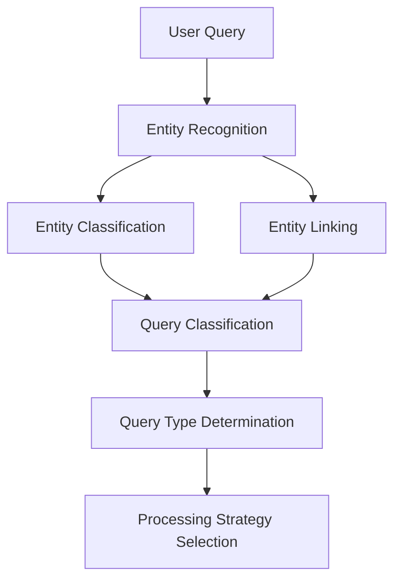
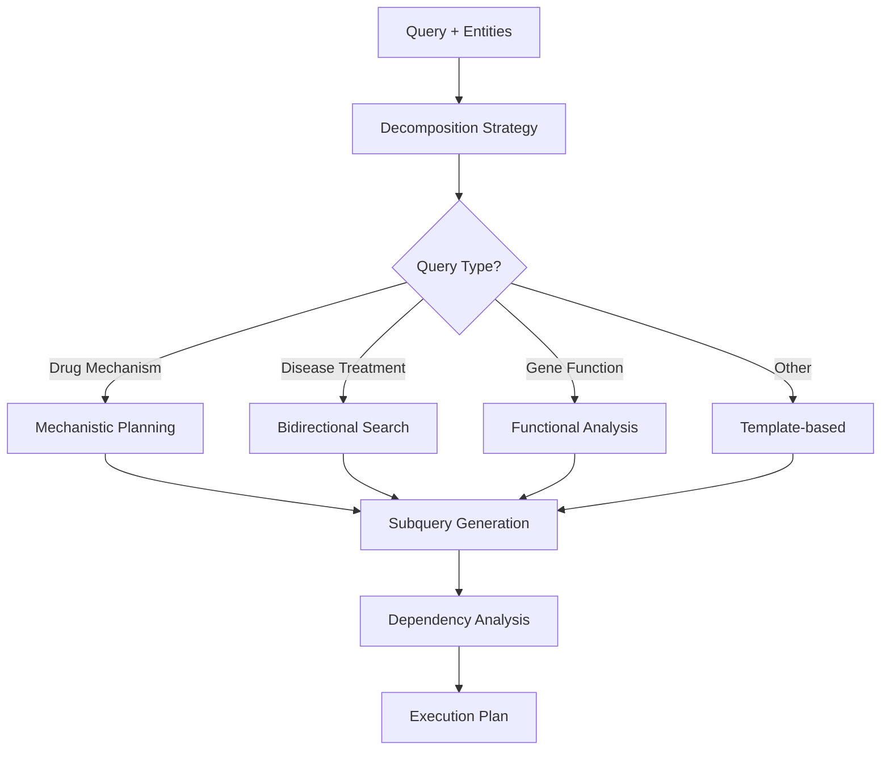
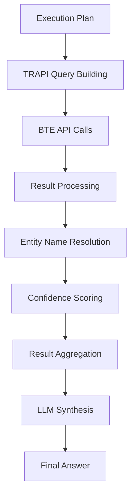
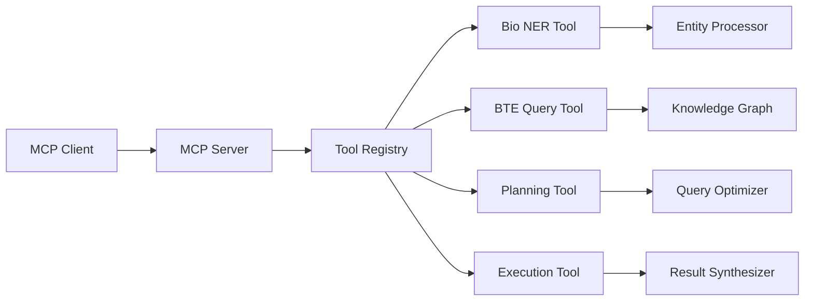
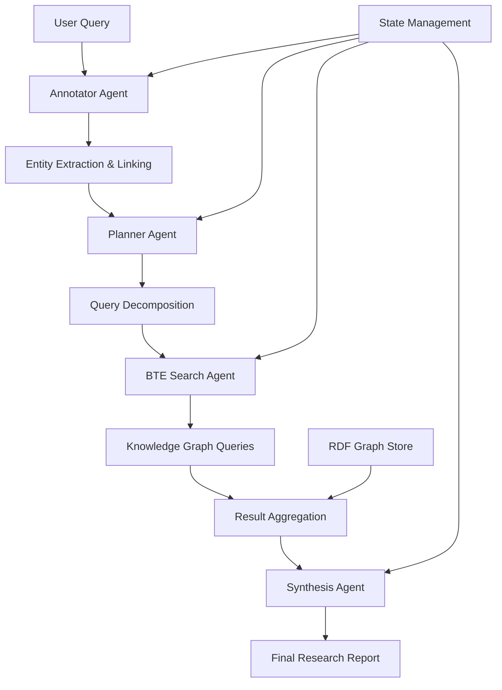

# Agentic BTE Architecture

This document provides a comprehensive overview of the Agentic BTE system architecture, design patterns, and component interactions.

## 🏗️ System Overview

Agentic BTE is designed as a modular, multi-agent biomedical research platform that combines:

- **Natural Language Processing** for biomedical entity recognition and query understanding
- **Knowledge Graph APIs** for comprehensive biomedical data access
- **Large Language Models** for intelligent reasoning and synthesis
- **Agent Architectures** for autonomous research workflows

## 🧱 Core Architecture

### High-Level System Architecture

```
┌─────────────────────────────────────────────────────────────┐
│                    Agentic BTE System                       │
├─────────────────────────────────────────────────────────────┤
│                                                             │
│  ┌─────────────────┐    ┌─────────────────┐                │
│  │   MCP Server    │    │ LangGraph Agent │                │
│  │   Architecture  │    │  Architecture   │                │
│  └─────────────────┘    └─────────────────┘                │
│           │                       │                        │
│           └───────────┬───────────┘                        │
│                       │                                    │
│  ┌─────────────────────────────────────────────────────────┐ │
│  │              Core Processing Layer                      │ │
│  │  ┌───────────────┐ ┌───────────────┐ ┌───────────────┐ │ │
│  │  │   Entities    │ │    Queries    │ │   Knowledge   │ │ │
│  │  │  Recognition  │ │ Classification│ │ Graph Client  │ │ │
│  │  │   & Linking   │ │ & Optimization│ │   (BTE/TRAPI) │ │ │
│  │  └───────────────┘ └───────────────┘ └───────────────┘ │ │
│  └─────────────────────────────────────────────────────────┘ │
│                                                             │
│  ┌─────────────────────────────────────────────────────────┐ │
│  │               Infrastructure Layer                      │ │
│  │  ┌───────────────┐ ┌───────────────┐ ┌───────────────┐ │ │
│  │  │ Configuration │ │   Exceptions  │ │   Utilities   │ │ │
│  │  │  Management   │ │   & Logging   │ │   & Caching   │ │ │
│  │  └───────────────┘ └───────────────┘ └───────────────┘ │ │
│  └─────────────────────────────────────────────────────────┘ │
└─────────────────────────────────────────────────────────────┘
```

## 🔄 Processing Pipeline

### 1. Query Understanding Phase



**Components:**
- **Entity Recognition**: spaCy/SciSpaCy + LLM-based extraction
- **Entity Classification**: Biomedical entity type classification
- **Entity Linking**: UMLS + SRI Name Resolver integration
- **Query Classification**: LLM-based semantic understanding

### 2. Query Planning Phase



**Strategies:**
- **Mechanistic Planning**: Drug → Targets → Pathways → Disease
- **Bidirectional Search**: Forward + backward + convergence
- **Functional Analysis**: Entity → Function → Related entities
- **Template-based**: Predefined patterns for known query types

### 3. Execution Phase



**Components:**
- **TRAPI Builder**: Convert subqueries to TRAPI format
- **BTE Client**: Execute queries against knowledge graph
- **Result Processor**: Parse and validate API responses
- **Name Resolver**: Map entity IDs to human-readable names
- **LLM Synthesizer**: Generate natural language summaries

## 🤖 Agent Architectures

### MCP Server Architecture



**Key Features:**
- **Async Tool Execution**: Non-blocking operations
- **Standardized Protocol**: MCP-compliant tool interface
- **Comprehensive Error Handling**: Robust failure management
- **Result Streaming**: Progressive result delivery

### LangGraph Multi-Agent Architecture



**Agent Roles:**
- **Annotator**: Entity recognition and biomedical annotation
- **Planner**: Query analysis and execution planning
- **BTE Search**: Knowledge graph querying and data retrieval
- **Synthesizer**: Result integration and natural language generation

## 📦 Module Structure

### Core Modules

#### `agentic_bte.core.entities`
```python
# Entity Recognition & Processing
BiomedicalEntityRecognizer()
- extract_entities()
- classify_entity_types()  
- link_to_knowledge_bases()
- resolve_entity_names()
```

#### `agentic_bte.core.queries`
```python
# Query Understanding & Optimization
QueryClassifier()
QueryDecomposer()
QueryOptimizer()
- classify_query_type()
- decompose_complex_query()
- optimize_execution_plan()
```

#### `agentic_bte.core.knowledge`
```python
# Knowledge Graph Integration
BTEClient()
TRAPIQueryBuilder()
- build_trapi_queries()
- execute_knowledge_graph_queries()
- process_biomedical_results()
```

### Agent Implementations

#### `agentic_bte.agents`
```python
# Multi-Agent Orchestration
BiomedicalResearchAgent()
LangGraphOrchestrator()
- coordinate_research_workflow()
- manage_agent_interactions()
- synthesize_research_results()
```

### Server Implementations

#### `agentic_bte.servers.mcp`
```python
# MCP Protocol Server
MCPServer()
MCPToolRegistry()
- register_biomedical_tools()
- handle_async_tool_calls()
- manage_client_sessions()
```

## 🔧 Configuration Management

### Settings Architecture

```python
# Centralized Configuration
AgenticBTESettings()
- api_keys: OpenAI, external services
- model_settings: Temperature, model selection
- processing_params: Thresholds, limits
- feature_flags: Enable/disable functionality
- performance_settings: Caching, retries
```

### Environment Integration
- **Development**: `.env` file support
- **Production**: Environment variable override
- **Testing**: Isolated test configuration
- **Validation**: Pydantic-based validation

## 🚨 Error Handling Strategy

### Exception Hierarchy

```python
AgenticBTEError (Base)
├── ConfigurationError
├── ValidationError
├── ExternalServiceError
├── ProcessingTimeoutError
├── EntityError
│   ├── EntityRecognitionError
│   ├── EntityLinkingError
│   ├── EntityClassificationError
│   └── EntityResolutionError
└── QueryError
    ├── QueryClassificationError
    ├── QueryDecompositionError
    └── QueryExecutionError
```

### Error Recovery Patterns
- **Graceful Degradation**: Fallback to simpler methods
- **Retry Logic**: Exponential backoff for external services
- **Circuit Breaker**: Prevent cascade failures
- **Detailed Logging**: Comprehensive debug information

## 🔄 Data Flow Patterns

### Request-Response Flow

1. **Input Validation**: Query parsing and parameter validation
2. **Entity Processing**: Recognition, classification, linking
3. **Query Analysis**: Type classification and decomposition
4. **Execution Planning**: Strategy selection and optimization
5. **Knowledge Querying**: TRAPI query execution
6. **Result Processing**: Data parsing and validation
7. **Name Resolution**: ID-to-name mapping
8. **Synthesis**: LLM-based answer generation
9. **Response Formatting**: Structured output generation

### Caching Strategy

```python
# Multi-Level Caching
L1: In-Memory (Entity recognition results)
L2: Application (Query plans, API responses)  
L3: Persistent (Entity name mappings)
```

## 🎯 Design Patterns

### Strategy Pattern
- **Query Decomposition**: Different strategies per query type
- **Entity Linking**: Multiple resolution strategies
- **Error Handling**: Contextual error recovery

### Factory Pattern
- **Tool Creation**: Dynamic tool instantiation
- **Client Creation**: Service client generation
- **Agent Creation**: Multi-agent system setup

### Observer Pattern
- **Progress Tracking**: Real-time execution monitoring
- **Event Logging**: Comprehensive audit trails
- **State Management**: Agent state synchronization

## 📊 Performance Considerations

### Optimization Strategies

1. **Parallel Execution**: Concurrent subquery processing
2. **Result Caching**: Avoid duplicate API calls
3. **Query Batching**: Minimize network round trips
4. **Lazy Loading**: Load entities and results on demand
5. **Connection Pooling**: Efficient HTTP client management

### Scalability Patterns

- **Stateless Design**: No server-side state dependencies
- **Horizontal Scaling**: Multiple server instances
- **Load Balancing**: Request distribution
- **Rate Limiting**: API quota management

## 🧪 Testing Architecture

### Test Categories

1. **Unit Tests**: Individual component testing
2. **Integration Tests**: Component interaction testing
3. **External Service Tests**: API integration validation
4. **End-to-End Tests**: Complete workflow validation
5. **Performance Tests**: Load and stress testing

### Testing Patterns

- **Mock Services**: External API simulation
- **Test Fixtures**: Consistent test data
- **Property Testing**: Input validation testing
- **Regression Testing**: Change impact validation

## 🚀 Deployment Patterns

### Container Architecture
```dockerfile
# Multi-stage build
FROM python:3.11-slim as base
# Install dependencies
FROM base as production
# Copy application code
```

### Service Discovery
- **Health Checks**: Service availability monitoring
- **Service Registry**: Dynamic service discovery
- **Load Balancing**: Request distribution
- **Graceful Shutdown**: Clean service termination

## 🔮 Future Architecture Evolution

### Planned Enhancements

1. **Vector Search**: Semantic similarity over literature
2. **Multi-Modal**: Image and molecular structure integration
3. **Federation**: Multi-knowledge graph support
4. **Real-time**: Streaming query execution
5. **Personalization**: User-specific optimization

### Extensibility Points

- **Plugin System**: Custom tool integration
- **Custom Agents**: Domain-specific agent types
- **Knowledge Sources**: Additional graph integration
- **Processing Pipelines**: Custom workflow definitions

---

This architecture provides a solid foundation for biomedical research automation while maintaining flexibility for future enhancements and domain-specific customizations.